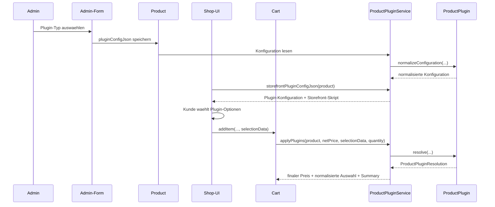

# Produkt-Plugin-Mechanismus in Easyshop

Diese Unterlage erklaert den Produkt-Plugin-Mechanismus in Easyshop so, dass man ihn im Unterricht Schritt fuer Schritt nachvollziehen kann. Sie beschreibt zuerst den echten Mechanismus im Projekt und zeigt danach ein stark vereinfachtes Lehrbeispiel im Package `com.trends.shop.education.productplugin`.

## 1. Grundidee

Ein Produkt-Plugin erweitert ein einzelnes Produkt um:

- zusaetzliche Eingaben im Admin
- zusaetzliche Eingaben im Shop
- eigene serverseitige Preislogik
- eine eigene Zusammenfassung fuer den Warenkorb

Wichtig ist die Trennung zwischen zwei Datenarten:

- `pluginConfigJson`
  Die Produkt-Konfiguration aus dem Admin.
- `selectionData.plugins`
  Die konkrete Kundenauswahl beim Kauf.

Der entscheidende Punkt fuer Schueler:
Die Browser-Oberflaeche darf nur helfen. Verbindlich sind immer die serverseitigen Regeln in `resolve(...)`.

## 2. Die reale Architektur im Projekt

Zentrale Dateien:

- `src/main/java/com/trends/shop/service/plugin/ProductPlugin.java`
- `src/main/java/com/trends/shop/service/plugin/ProductPluginResolution.java`
- `src/main/java/com/trends/shop/service/plugin/ProductPluginService.java`
- `src/main/java/com/trends/shop/model/Product.java`
- `src/main/java/com/trends/shop/model/Cart.java`
- `src/main/java/com/trends/shop/controller/AdminController.java`
- `src/main/java/com/trends/shop/controller/ShopController.java`
- `src/main/resources/templates/admin/product-form.html`
- `src/main/resources/templates/fragments/product-cards.html`

### Architekturkarte


### Laufzeitfluss



## 3. Datenmodell

### 3.1 Produktkonfiguration

Im Projekt liegt die Produktkonfiguration in `Product.pluginConfigJson`.

Beispiel:

```json
{
  "type": "surface-calculator",
  "title": "Flaechenrechner",
  "actionButtonLabel": "Flaechenrechner starten",
  "defaultOverhangCm": 20
}
```

Diese Daten kommen aus dem Admin und gelten fuer alle spaeteren Kaueufer dieses Produkts.

### 3.2 Kundenauswahl

Die Auswahl des Kunden landet in `selectionData`.

Beispiel:

```json
{
  "plugins": [
    {
      "type": "surface-calculator",
      "shape": "oval",
      "lengthCm": 140,
      "widthCm": 100,
      "overhangCm": 20
    }
  ]
}
```

Didaktisch wichtig:

- Die Produktkonfiguration beantwortet: "Wie funktioniert dieses Produkt grundsaetzlich?"
- Die Kundenauswahl beantwortet: "Was hat genau dieser Kunde eingegeben?"

## 4. Wer macht was?

### `ProductPlugin`

Das Interface definiert den Vertrag fuer jedes Plugin:

- `getType()`
  Technischer Schluessel.
- `getDisplayName()`
  Anzeigename im Admin.
- `normalizeConfiguration(...)`
  Bereinigt und validiert die Produktkonfiguration.
- `resolve(...)`
  Berechnet serverseitig Preis, Summary und normalisierte Auswahl.

### `ProductPluginService`

Diese Klasse ist die Zentrale des Mechanismus:

- laedt Plugins ueber `ServiceLoader`
- sucht externe Plugin-JARs
- ordnet Plugins ueber `type` zu
- normalisiert Konfigurationen
- liest Admin- und Storefront-Skripte aus dem Plugin
- ruft zur Laufzeit `resolve(...)` auf

### `AdminController` und `product-form.html`

Diese Teile stellen im Admin:

- die Liste verfuegbarer Plugins
- die Admin-Skripte der Plugins
- das Speichern von `pluginConfigJson`

### `ShopController` und `product-cards.html`

Diese Teile stellen im Shop:

- die Storefront-Skripte der Plugins
- die Plugin-Konfiguration fuer das jeweilige Produkt
- die Uebergabe der Kundenauswahl in `selectionData`

### `Cart`

Der Warenkorb kombiniert:

1. Variantenpreis
2. Plugin-Preislogik
3. steuerliche Darstellung

Das Plugin arbeitet also nicht isoliert, sondern als Teil der gesamten Preisberechnung.

## 5. Fachlich wichtiger Ablauf im Code

### Schritt 1: Plugin laden

Beim Start scannt `ProductPluginService` nach JAR-Dateien:

- im Projektwurzelverzeichnis
- in `target/`
- unter `plugin/**/target/`

Zusatz:
Im Entwicklungsmodus werden auch Plugins vom Klassenpfad akzeptiert.

### Schritt 2: Plugin registrieren

Ein Plugin muss in seiner JAR-Datei einen `ServiceLoader`-Eintrag mitbringen:

```text
META-INF/services/com.trends.shop.service.plugin.ProductPlugin
```

Ohne diesen Eintrag wird das Plugin nicht gefunden.

### Schritt 3: Produkt konfigurieren

Im Admin wird ein Plugin-Typ fuer ein Produkt ausgewaehlt. Danach liefert das Plugin optional ein eigenes Admin-Skript, das seine Felder rendert und am Ende ein JSON fuer `pluginConfigJson` erzeugt.

### Schritt 4: Shop-Oberflaeche erweitern

Im Shop bekommt das Plugin optional ein Storefront-Skript. Dieses zeigt dem Kunden plugin-spezifische Eingaben an und schreibt die Auswahl in `selectionData`.

### Schritt 5: Serverseitig aufloesen

Beim Hinzufuegen zum Warenkorb ruft `Cart.resolveSelection(...)` die Methode `productPluginService.applyPlugins(...)` auf.

Diese Methode:

1. liest `pluginConfigJson`
2. bestimmt den `type`
3. findet das passende Plugin
4. extrahiert die Plugin-Auswahl aus `selectionData.plugins`
5. ruft `plugin.resolve(...)` auf
6. speichert die normalisierte Auswahl wieder in `selectionData`
7. uebergibt den berechneten Netto-Preis an den Warenkorb

## 6. Didaktisch interessante Details

### Genau ein konfiguriertes Produkt-Plugin pro Produkt

Ein Produkt speichert aktuell genau eine Plugin-Konfiguration in `pluginConfigJson`.

### Trotzdem ist `selectionData.plugins` ein Array

Das ist architektonisch interessant:

- die Produktkonfiguration ist heute auf genau ein Plugin ausgelegt
- das Auswahlformat ist schon so gebaut, dass mehrere Plugin-Eintraege moeglich waeren

Fuer den Unterricht ist das ein gutes Beispiel fuer "heute einfach, spaeter erweiterbar".

### Server vor Browser

Auch wenn das Storefront-Skript schon im Browser eine Preisvorschau zeigt, ist nur der Server verbindlich. Das ist ein zentraler Sicherheitsaspekt.

### Doppelte Typen werden abgefangen

Wenn zwei Plugins denselben `type` liefern, aktiviert der Loader nur eines davon und protokolliert den Konflikt.

## 7. So wuerde man selbst ein Plugin implementieren

1. Eine Klasse schreiben, die `ProductPlugin` implementiert.
2. Einen stabilen `type` festlegen.
3. In `normalizeConfiguration(...)` alle Defaults und Validierungen kapseln.
4. In `resolve(...)` die komplette serverseitige Preis- und Summary-Logik implementieren.
5. Falls noetig ein Admin-Skript fuer die Produktkonfiguration bereitstellen.
6. Falls noetig ein Storefront-Skript fuer die Kundeneingabe bereitstellen.
7. Die Klasse ueber `META-INF/services/...` fuer `ServiceLoader` registrieren.
8. Das Plugin als eigenes JAR bauen.

## 8. Vereinfachtes Lehrbeispiel im Repository

Fuer den Unterricht gibt es jetzt zusaetzlich ein kleines, eigenstaendiges Beispiel:

- Package: `com.trends.shop.education.productplugin`
- Test: `com.trends.shop.education.productplugin.EducationalProductPluginDemoTest`

Dieses Beispiel zeigt denselben Mechanismus in klein:

- ein Produkt mit `pluginConfiguration`
- eine Registry, die Plugins ueber `type` findet
- ein Beispiel-Plugin `gift-wrap`
- serverseitige Preisberechnung
- normalisierte Auswahl fuer den Warenkorb

Das Beispiel ist absichtlich einfacher als der Produktivcode, damit Schueler zuerst das Muster lernen und erst danach die Spring-, Thymeleaf- und JSON-Details des echten Systems ansehen.

## 9. Unterrichtsvorschlag

Eine sinnvolle Reihenfolge fuer den Unterricht:

1. Erst das Lehrbeispiel im `education`-Package erklaeren.
2. Danach das echte Interface `ProductPlugin` zeigen.
3. Dann den Ablauf durch `ProductPluginService`, `ShopController` und `Cart` verfolgen.
4. Zum Schluss ein eigenes Mini-Plugin entwerfen lassen.

## 10. Merksatz

Ein Produkt-Plugin in Easyshop ist kein isoliertes UI-Skript, sondern ein kompletter Vertrag aus:

- Konfiguration im Admin
- Eingabe im Shop
- serverseitiger Aufloesung
- normalisierter Speicherung
- sicherer Preisberechnung
