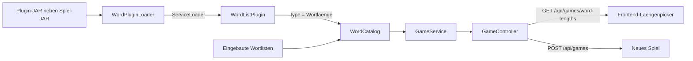
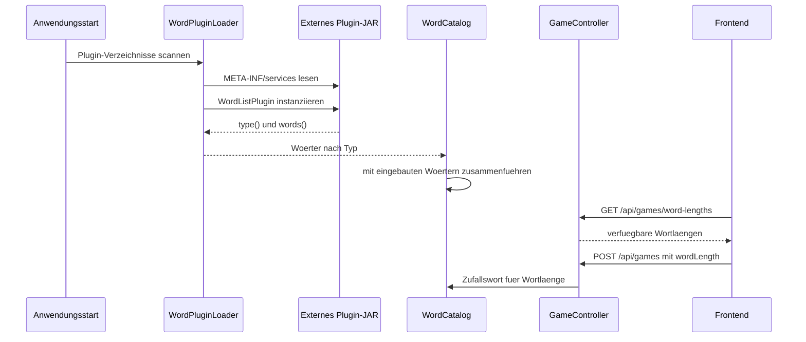

# WORDL Wort-Plugin-Mechanismus

Diese Unterlage beschreibt den Plugin-Mechanismus fuer WORDL. Ein Plugin erweitert das Spiel um zusaetzliche Loesungswoerter. Es wird als JAR-Datei in denselben Ordner gelegt wie das gestartete Spiel-JAR und beim Start automatisch geladen.

Es wird hier bewusst kein Plugin gebaut. Diese Dokumentation beschreibt nur den Vertrag, damit ein Plugin separat erstellt werden kann.

## 1. Grundidee

Ein Wort-Plugin liefert eine Wortliste fuer genau eine Wortlaenge.

Der Plugin-Typ ist die Anzahl der Buchstaben:

- Typ `4` liefert Vier-Buchstaben-Woerter.
- Typ `5` liefert Fuenf-Buchstaben-Woerter.
- Typ `7` liefert Sieben-Buchstaben-Woerter.

Das Backend kombiniert die eingebauten Wortlisten mit allen geladenen Plugin-Wortlisten. Die Oberflaeche fragt die verfuegbaren Wortlaengen ueber die API ab und zeigt neue Laengen automatisch im Picker an.

## 2. Architektur

Zentrale Dateien im WORDL-Projekt:

- `backend/src/main/java/de/demo/wordl/backend/plugin/WordListPlugin.java`
- `backend/src/main/java/de/demo/wordl/backend/service/WordPluginLoader.java`
- `backend/src/main/java/de/demo/wordl/backend/service/WordCatalog.java`
- `backend/src/main/java/de/demo/wordl/backend/service/GameService.java`
- `backend/src/main/java/de/demo/wordl/backend/api/GameController.java`
- `frontend/src/main/resources/static/app.js`

### Architekturkarte



### Laufzeitfluss



## 3. Plugin-Vertrag

Ein Plugin implementiert dieses Interface:

```java
package de.demo.wordl.backend.plugin;

import java.util.List;

public interface WordListPlugin {
    int type();

    List<String> words();
}
```

Regeln:

- `type()` gibt die Wortlaenge als Zahl zurueck.
- Jedes Wort aus `words()` muss exakt diese Laenge haben.
- Woerter duerfen nur die Buchstaben `A` bis `Z` enthalten.
- Kleinbuchstaben sind erlaubt; das Backend normalisiert auf Grossbuchstaben.
- Ungueltige Woerter werden beim Zusammenfuehren ignoriert.
- Doppelte Woerter werden entfernt.

## 4. ServiceLoader-Eintrag

Damit Java das Plugin findet, muss das Plugin-JAR diese Datei enthalten:

```text
META-INF/services/de.demo.wordl.backend.plugin.WordListPlugin
```

Der Inhalt ist der vollqualifizierte Klassenname der Plugin-Implementierung, zum Beispiel:

```text
com.example.wordl.SevenLetterWordsPlugin
```

Ohne diesen Eintrag wird das JAR zwar gefunden, aber kein Plugin daraus registriert.

## 5. Ladeort

Beim Start sucht `WordPluginLoader` nach JAR-Dateien:

- im Ordner aus der System-Property `wordl.plugin.dir`
- alternativ im Ordner aus der Umgebungsvariable `WORDL_PLUGIN_DIR`
- im Ordner der laufenden Anwendung
- im aktuellen Arbeitsverzeichnis

Der normale Zielzustand fuer den Unterricht ist:

```text
spiel-ordner/
  backend-0.0.1-SNAPSHOT.jar
  mein-wort-plugin.jar
```

Danach wird das Spiel neu gestartet. Plugins werden nur beim Start geladen.

## 6. API-Auswirkung

Das Backend stellt die verfuegbaren Wortlaengen bereit:

```http
GET /api/games/word-lengths
```

Beispielantwort ohne Plugin:

```json
[4, 5, 6]
```

Beispielantwort mit einem Sieben-Buchstaben-Plugin:

```json
[4, 5, 6, 7]
```

Ein neues Spiel wird danach wie bisher gestartet:

```http
POST /api/games
Content-Type: application/json

{"wordLength":7}
```

## 7. Fehlerbilder

Wenn ein Plugin nicht sichtbar wird, zuerst diese Punkte pruefen:

- Liegt das Plugin-JAR im selben Ordner wie das Spiel-JAR?
- Wurde das Spiel nach dem Kopieren des Plugins neu gestartet?
- Enthaelt das JAR die Datei `META-INF/services/de.demo.wordl.backend.plugin.WordListPlugin`?
- Steht in dieser Datei der korrekte Klassenname?
- Implementiert die Klasse wirklich `de.demo.wordl.backend.plugin.WordListPlugin`?
- Gibt `type()` die richtige Buchstabenanzahl zurueck?
- Haben alle Woerter exakt diese Laenge und nur `A` bis `Z`?

